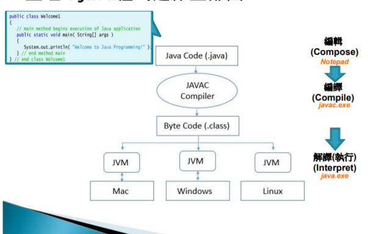

# 前言
第一次期中考會考環境變數

* class 定義java 程式的必要關鍵字，一般來說 class 命名第一個字會打大寫
* public 全域

# 程式碼
* java程式一定要main method

Declare a main method:
```java
public static void main(String[] args){}
```
* void 表示本函式不會回傳任何值
```java
System.out.println("Hello World");
```
* System大寫即是因為他是class的名稱

## print三種寫法
1. System.out.println("Hello World");
2. System.out.print("Hello World");
3. System.out.printf("Hello World");

### printf()
格式化列印
```java
System.out.printf("%s %s %s", "Hello ", "World ", "!");
```
```bash
>> Hello World !
``` 
* Placeholder: %s string / %d integer / %f float, double (%1.f 只印出小數後一位)/ %n=/n

## comments
```java
//
```
```java
/* */
```
## Important rules
1. Case sensitive
2. Every command need to split by ';'
3. 程式結構宜分層內縮

## Compile and execute Java programs
1. Complie a source code
```bash
javac name.java
```
2. Execute the program
```bash
java name
```
* JVM(Java Virtual Machine) translates the .class file into instructions for different OS.



# Q&A
1. 虛擬機器? java.exe
2. 編譯器? javac.exe / javac
3. 程式? test.java
4. 執行? java.class
5. Source code? Complier? Bytecode? Interpreter? JVM? 考試會考

## Escape Sequence Commands
* \n \t \r \\ \" etc.

## 中文notepad存檔
存檔時改ansi即可

## 兩數相加
```java
import java.util.Scanner;
public class Addition{
    public static void main(String[] args){
        Scanner input = new Scanner(System.in); //create a Scanner object to obtain from the command window
        int n1,n2,sum;
        System.out.print("Enter first integer: ");
        n1=input.nextInt();
        System.out.print("Enter Second Integer: ");
        n2=input.nextInt();
        sum=n1+n2;
        System.out.printf("The sum of %d and %d is %d",n1,n2,sum);
    }
}
```
1. nextInt 讀取整數
2. nextLine 讀取字串
3. nextDouble 讀取浮點數

## Java變數型態
有兩種(考試會考):
* 基本資料型態(primitive data type, PDT)
    1. boolean
    2. short < int < long
    3. float < double
    4. char 0~65535
    5. byte -128~127
* 物件型態(object type, ODT)
    6. String 字串型態 (Java 字串非 ODT !!!)

## 算術運算
**=** 是 **指定運算子(Assignment Operator)** , 而非數學的等號 會考!

## Arithmetic operators 算術運算子
加 / 減 / 乘 / 除 / 餘數

